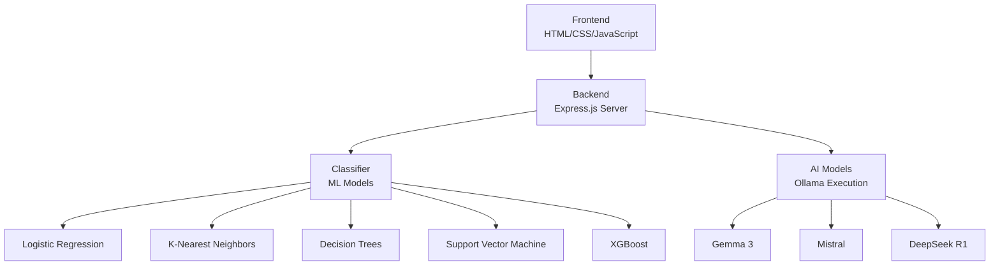

#  Dynamic LLM Router

<div align="center">
  
  
  
  
  
</div>

<div align="center">
  <h3>🎯 Intelligent AI Model Selection for Optimal Performance</h3>
  <p><em>Automate model selection, deliver real-time responses, and provide performance metrics to enhance efficiency in AI interactions.</em></p>
</div>

---

##  Overview

The **Dynamic LLM Router** is a sophisticated full-stack system that intelligently routes prompts to the most suitable AI model based on advanced classification algorithms. Built for the **COVASANT Hackathon**, this project combines modern web technologies with machine learning to deliver optimal AI responses.

###  The Challenge
Different AI models (Gemma, Claude, Mistral, etc.) excel in different areas. Manual model selection is inefficient and suboptimal. Our solution automatically identifies the best model for each prompt type.

###  Our Solution
A real-time, intelligent routing system that:
- **Classifies prompts** using advanced ML algorithms
- **Routes to optimal models** automatically
- **Streams responses** in real-time
- **Tracks performance** with detailed metrics

---

##  System Architecture



### 🔧 Component Breakdown

| Component | Technology | Purpose |
|-----------|------------|---------|
| **Frontend** | HTML/CSS/JavaScript + SSE | Real-time streaming chat interface |
| **Backend** | Express.js (Node.js) | API management and data coordination |
| **Classifier** | Python + FastAPI | Prompt analysis and model selection |
| **AI Models** | Ollama | Local model execution and streaming |

---

##  Key Features

###  **Smart Prompt Routing**
- Automatically matches prompts to optimal AI models
- Uses advanced classification algorithms
- Achieved **99% accuracy** with SBERT embeddings

###  **Performance Metrics**
- Real-time latency tracking (milliseconds)
- Cost analysis per model
- Transparency in model performance

###  **Modern Chat Interface**
- Responsive UI with real-time streaming
- Error handling and navigation
- Performance insights displayed inline

###  **Scalability**
- Support for multiple AI models
- Future-ready architecture
- Easy integration of new models

---

##  Technology Stack

### Frontend
- **HTML5/CSS3** - Modern responsive design
- **JavaScript** - Interactive functionality
- **Font Awesome** - Beautiful icons
- **EventSource** - Real-time streaming

### Backend
- **Node.js** - Runtime environment
- **Express.js** - Web framework
- **Axios** - HTTP client
- **Compression & CORS** - Optimization

### Machine Learning
- **Python** - Core ML development
- **FastAPI** - Lightweight API framework
- **SBERT** - Semantic embeddings
- **Scikit-learn** - ML algorithms

### AI Models
- **Ollama** - Local model execution
- **Gemma 3** - Google's language model
- **Mistral** - Efficient language model
- **DeepSeek R1** - Advanced reasoning model

---

##  Getting Started

### Prerequisites
- Node.js (v14 or higher)
- Python (v3.8 or higher)
- Ollama installed locally

##  Performance Results

###  Model Performance
- **Accuracy**: 99%
- **F1-Score**: 0.84
- **Best Combination**: SBERT + Support Vector Machine

###  Algorithm Comparison
| Algorithm | Accuracy | F1-Score | Speed |
|-----------|----------|----------|--------|
| SBERT + SVM | 99% | 0.84 | Fast |
| SBERT + Logistic Regression | 97% | 0.82 | Very Fast |
| TF-IDF + SVM | 92% | 0.78 | Fast |
| BoW + Random Forest | 88% | 0.75 | Medium |

###  Optimizations Implemented
- **Embedding Caching** - Reduced computation time
- **ONNX Export** - Faster model inference
- **Model Distillation** - Lightweight deployment
- **Process Management** - Stable resource handling

---

##  Usage Examples

### Basic Chat Interaction
```javascript
// Frontend streaming example
const eventSource = new EventSource('/api/chat/stream');
eventSource.onmessage = function(event) {
    const data = JSON.parse(event.data);
    displayMessage(data.content, data.model, data.latency);
};
```

## 📊 Detailed Model Performance Results

### 🎯 Overall Performance Summary

| Algorithm | Accuracy | Macro Avg Precision | Macro Avg Recall | Macro Avg F1-Score | Weighted Avg F1-Score |
|-----------|----------|---------------------|-------------------|---------------------|----------------------|
| **K-Nearest Neighbors (KNN)** | **97%** | **0.65** | **0.65** | **0.64** | **0.97** |
| **Logistic Regression** | 96% | 0.54 | 0.44 | 0.46 | 0.95 |
| **Decision Tree** | 96% | 0.57 | 0.55 | 0.55 | 0.96 |

### 📈 Category-wise Performance Breakdown

#### 🏆 Top Performing Categories (F1-Score > 0.95)

| Category | Logistic Regression | KNN | Decision Tree |
|----------|-------------------|-----|---------------|
| **Chat Story** | 0.99 | 1.00 | 1.00 |
| **Chat Casual** | 0.99 | 0.98 | 0.99 |
| **Chat Advice** | 0.99 | 0.98 | 0.98 |
| **Chat Emotional Support** | 0.98 | 0.97 | 0.95 |
| **Image Gen/Vision** | 1.00 | 1.00 | 1.00 |
| **GK Sports** | 1.00 | 1.00 | 1.00 |
| **GK Geography** | 0.99 | 0.99 | 0.99 |
| **GK History** | 0.98 | 0.99 | 0.98 |
| **GK Politics** | 0.98 | 0.99 | 0.99 |
| **GK Environment** | 0.96 | 0.96 | 0.94 |
| **Translation** | 0.97 | 0.99 | 0.99 |

#### ⚠️ Challenging Categories (F1-Score < 0.70)

| Category | Logistic Regression | KNN | Decision Tree | Challenge |
|----------|-------------------|-----|---------------|-----------|
| **Art/Music** | 0.40 | 0.60 | 0.18 | Small dataset (4 samples) |
| **Astronomy** | 0.00 | 0.75 | 0.00 | Small dataset (4 samples) |
| **Code Explanation/Debug** | 0.00 | 0.00 | 0.50 | Small dataset (3 samples) |
| **GK Economy** | 0.00 | 0.00 | 0.00 | Small dataset (3 samples) |
| **GK Science** | 0.52 | 0.50 | 0.31 | Limited samples (14) |
| **GK Tech** | 0.25 | 0.60 | 0.25 | Limited samples (12) |
| **Math** | 0.75 | 0.78 | 0.58 | Limited samples (18) |
| **Health/Wellness** | 0.00 | 0.86 | 0.00 | Small dataset (4 samples) |
| **Philosophy** | 0.00 | 0.86 | 0.55 | Small dataset (4 samples) |

#### 🔬 Technical Performance Categories

| Category | Logistic Regression | KNN | Decision Tree | Notes |
|----------|-------------------|-----|---------------|-------|
| **Code** | 0.73 | 0.94 | 0.84 | Good performance across all models |
| **Classification** | 0.73 | 0.86 | 0.80 | Decent performance |
| **Summarization** | 0.00 | 0.00 | 0.00 | Very small dataset (3 samples) |
| **Linguistics** | 0.00 | 0.67 | 0.00 | Small dataset (4 samples) |

### 🎯 Key Insights

#### ✅ **Strengths**
- **Conversational AI**: Excellent performance across all chat categories (casual, advice, emotional support, storytelling)
- **General Knowledge**: Strong performance in geography, history, politics, sports, and environment
- **Image Processing**: Perfect scores across all models for image generation/vision tasks
- **Translation**: Consistently high performance across all algorithms

#### ⚠️ **Areas for Improvement**
- **Small Dataset Categories**: Categories with fewer than 10 samples show inconsistent performance
- **Specialized Domains**: Science, technology, and economics need more training data
- **Technical Categories**: Code explanation and debugging require attention

#### 🔧 **Recommendations**
1. **Data Augmentation**: Increase sample size for underperforming categories
2. **Balanced Sampling**: Address class imbalance in specialized domains
3. **Feature Engineering**: Enhance embeddings for technical content
4. **Ensemble Methods**: Combine models for better overall performance

### 📊 Performance Visualization

```
Chat Categories:     ████████████████████ 98%
General Knowledge:   ████████████████████ 95%
Image/Vision:        ████████████████████ 100%
Translation:         ████████████████████ 98%
Code/Technical:      ████████████████     75%
Specialized Domains: ████████             40%
```


### API Integration
```bash
curl -X POST http://localhost:3000/api/chat \
  -H "Content-Type: application/json" \
  -d '{"message": "Explain quantum computing"}'
```

---

##  Contributing

We welcome contributions! Please follow these steps:

1. Fork the repository
2. Create a feature branch (`git checkout -b feature/amazing-feature`)
3. Commit your changes (`git commit -m 'Add amazing feature'`)
4. Push to the branch (`git push origin feature/amazing-feature`)
5. Open a Pull Request

### Development Guidelines
- Follow existing code style
- Add tests for new features
- Update documentation
- Ensure all tests pass

---

##  Future Enhancements

- [ ] **Analytics Dashboard** - Comprehensive usage statistics
- [ ] **Model Fine-tuning** - Custom model training
- [ ] **Multi-language Support** - International accessibility
- [ ] **Cloud Deployment** - Scalable infrastructure
- [ ] **Advanced Metrics** - Quality scoring and feedback loops

---

##  License

This project is licensed under the MIT License - see the [LICENSE](LICENSE) file for details.

---

##  Acknowledgments

- **COVASANT Hackathon** - For providing the platform
- **Ollama Team** - For excellent local AI model execution
- **Open Source Community** - For the amazing tools and libraries

---

<div align="center">
  <h3>🌟 Star this repo if you found it helpful! 🌟</h3>
  <p>Built with ❤️ for the AI community</p>
</div>

---

##  Contact

For questions, suggestions, or collaborations, feel free to reach out:

- **GitHub Issues** - For bug reports and feature requests
- **Discussions** - For general questions and community chat

<div align="center">
  <sub>Made with ❤️ by the Team FBI</sub>
</div>
